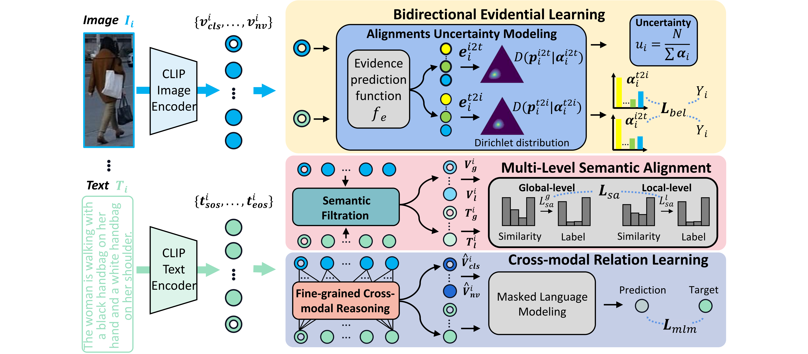

## Introduction
This is the source code of "Deep Cross-modal Evidential Learning for Text-Based Person
Retrieval"

## Deep Cross-modal Evidential Learning for Text-Based Person Retrieval
Our DCEL model comprises three components: (1) Bidirectional Evidential Learning, which models alignment uncertainty to measure and mitigate the influence of large intra-class
variation; (2) Multi-level Semantic Alignment, which leverages a proposed Semantic Filtration module and image-text similarity distribution to facilitate cross-modal alignments; (3) Cross-modal Relation Learning, which reasons about latent correspondences between multi-level tokens of image and text.

## Proposed Model (MSN-BRR)
* Bidirectional Evidential Learning
* Multi-level Semantic Alignment
* Cross-modal Relation Learning

## Motivation

Illustration of (a) a typical failure case of the latest method IRRA[11], (b) the cross-modal alignment uncertainty, which can be construed as a penalty of the total retrieved outcomes, indicates the degree of prevention from aligning a textual description with the particular identity.

## Results

## Retrieval Examples

## Usage
* Download the CUHK-PEDES dataset, ICFG-PEDES dataset and RSTPReid dataset
* Modify the parameters (dataset_name) in train.sh
* Run train.sh

